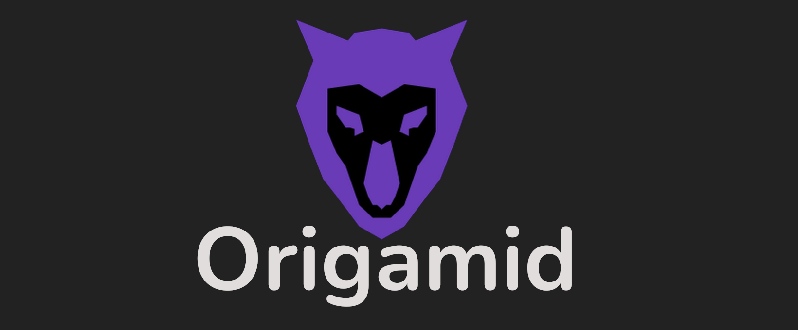

# FlexBlog

Esse repositório tem como objetivo mostrar mais um dos trabalhos desenvolvidos em cursos. O site do repositório foi desenvolvido no curso de Flexbox do Origamid, que é centrado em desenvolver os conhecimentos aprendidos sobre flexbox, os aplicando em um front end.

Os Conhecimentos são:

- flex-wrap
- justify-content
- align-items
- align-
- order
- align-self
- Entre Outros
